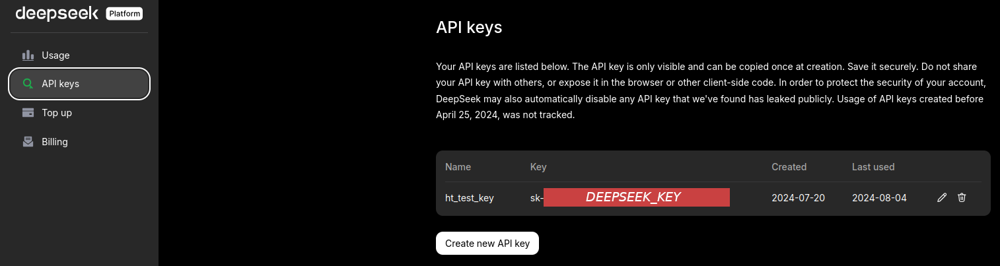

# Chat Bot for YouTube videos

A simple Gradio demo connecting YouTube with DeepSeek.

## How to Install and Run

1. In Linux/Unix/MacOS terminal:

```bash
git clone https://github.com/vsevolod-oparin/YtTalk
cd YtTalk 
pip3 install -r requirements.txt
```

2. Register in deepseek: https://platform.deepseek.com/api_keys and create API key.



3. Put the key into `secret.txt` (change `<DEEPSEK_KEY>` by the real key):
```bash
echo "{\"deepseek\": \"<DEEPSEEK_KEY>\"}" > secret.txt 
```

### How to Run
```bash
python3 run.py
```
Follow the address you'll see in terminal. E.g. http://127.0.0.1:7860
```bash
Running on local URL:  http://127.0.0.1:7860
```

